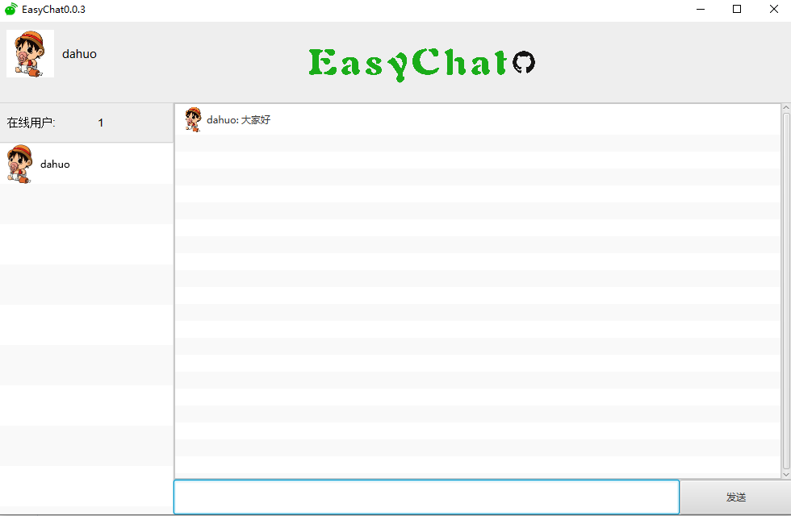
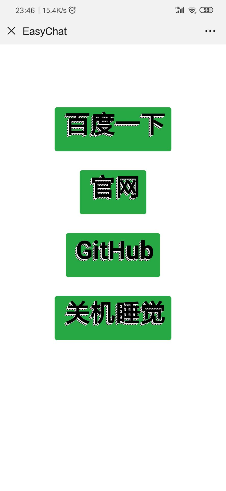

#### Project Profile

"EasyChat"  is not easy, it is not only a WAN chat software, but also a cross-platform chat software, and a remote control software.

####  项目介绍

“easychat”并不简单，它不仅是一个广域网聊天软件，也是一个跨平台的聊天软件，更是一个远程控制软件

#### 视频效果

https://www.bilibili.com/video/av65372361?pop_share=1

####  技术选型

- 后端技术：SpringBoot + Spring Data Jpa + H2数据库+Druid数据库连接池+ WebSocket+ Fastjson+Lombok
- 前端技术：JAVAFX+WebSocketClient+Hutool

##### 环境及插件要求

- Jdk8+
- Maven
- Lombok（重要）

ScreenCapture

Client:

Mobile  Page

